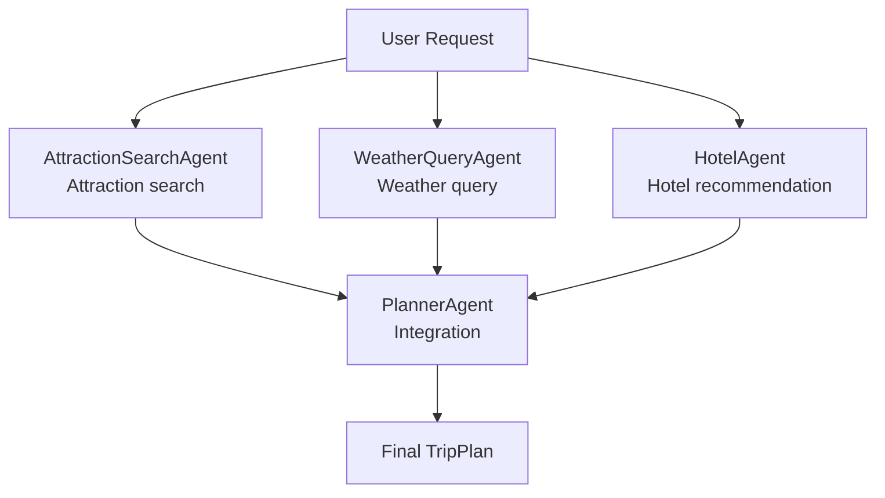

# Agent Role Design

This project follows a four-Agent collaboration workflow for trip planning.



## Roles

| Agent | Responsibility | Input | Tool |
| --- | --- | --- | --- |
| `AttractionSearchAgent` | Search and normalize attraction POI data | city, preferences | `amap_maps_text_search` |
| `WeatherQueryAgent` | Query and normalize weather data | city, date range | `amap_maps_weather` |
| `HotelAgent` | Search and normalize hotel POI data | city, accommodation, budget level | `amap_maps_text_search` |
| `PlannerAgent` | Integrate specialist outputs into a complete `TripPlan` | user request, attractions, weather, hotels | no external tool |

## Tool Call Formats

Attraction search:

```text
[TOOL_CALL:amap_maps_text_search:keywords=attraction_keyword,city=city_name]
```

Weather query:

```text
[TOOL_CALL:amap_maps_weather:city=city_name]
```

Hotel search:

```text
[TOOL_CALL:amap_maps_text_search:keywords=hotel,city=city_name]
```

## Collaboration Flow

1. `TripPlannerAgent` receives a validated `TravelPlanRequest`.
2. `AttractionSearchAgent` searches attraction candidates from user preferences.
3. `WeatherQueryAgent` queries weather for the destination and trip date range.
4. `HotelAgent` searches hotels based on accommodation and budget needs.
5. `TripPlannerAgent._build_planner_query()` builds a clear integration query for `PlannerAgent`.
6. `PlannerAgent` returns a validated `TripPlan` model.

## Source Map

- Prompts: `backend/app/agents/prompts.py`
- Shared Agent trace/result types: `backend/app/agents/base_agent.py`
- Specialist Agents: `backend/app/agents/*_agent.py`
- Multi-Agent workflow: `backend/app/agents/trip_planner_agent.py`
- API service boundary: `backend/app/services/planner_service.py`
- Observable trace endpoint: `GET /api/travel/agent-traces`
